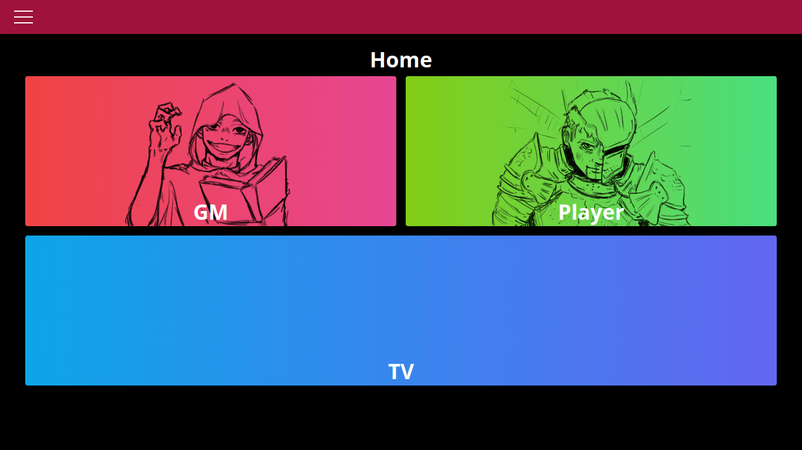
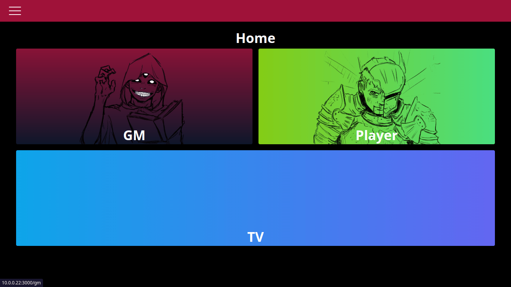
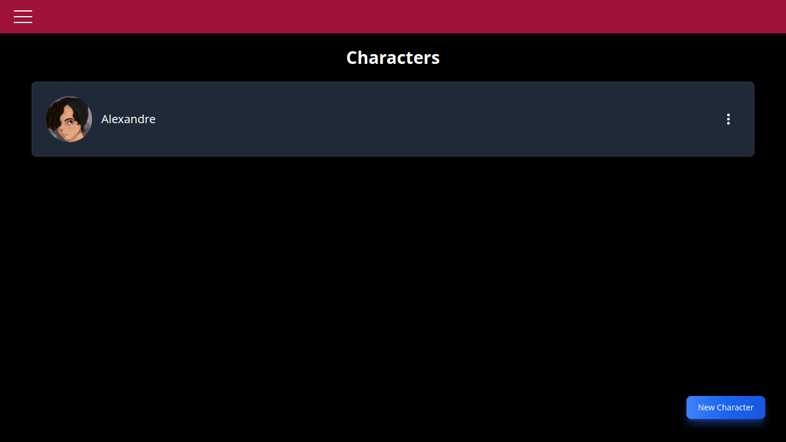
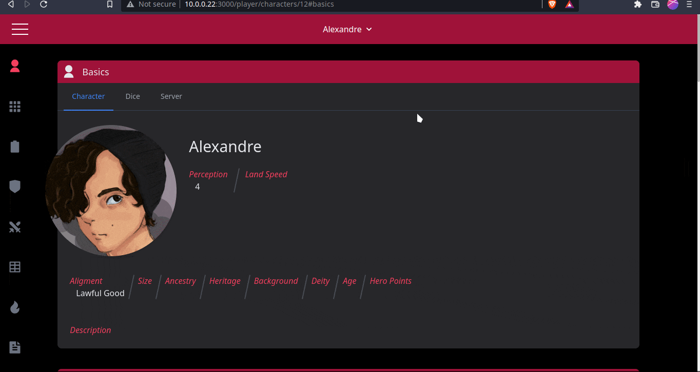
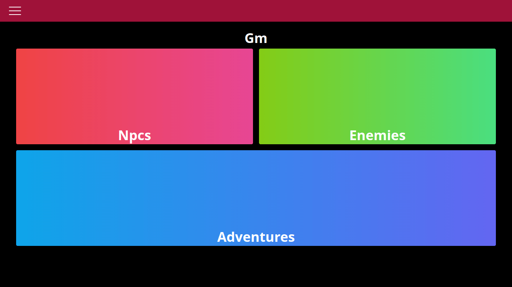
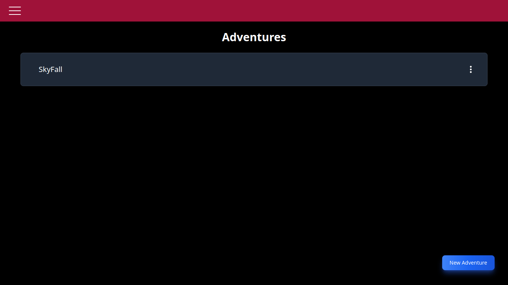
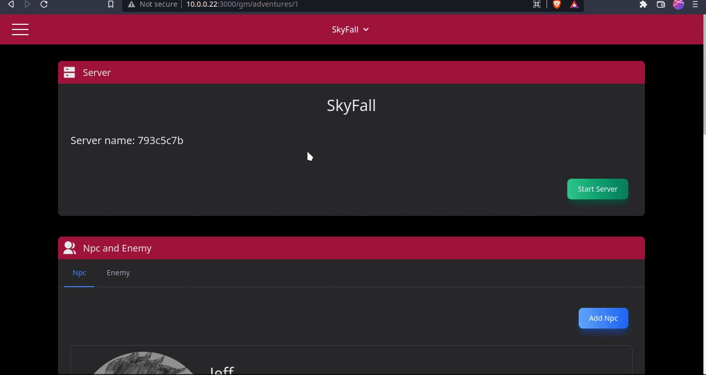
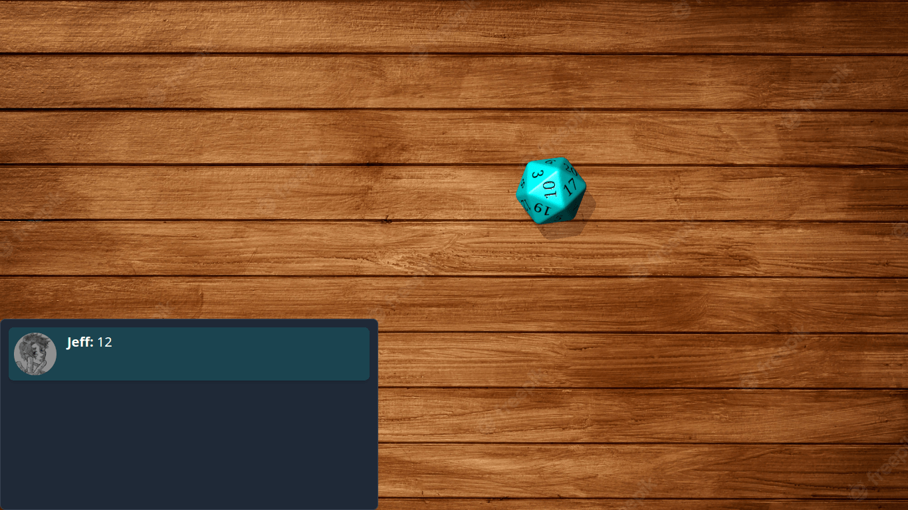
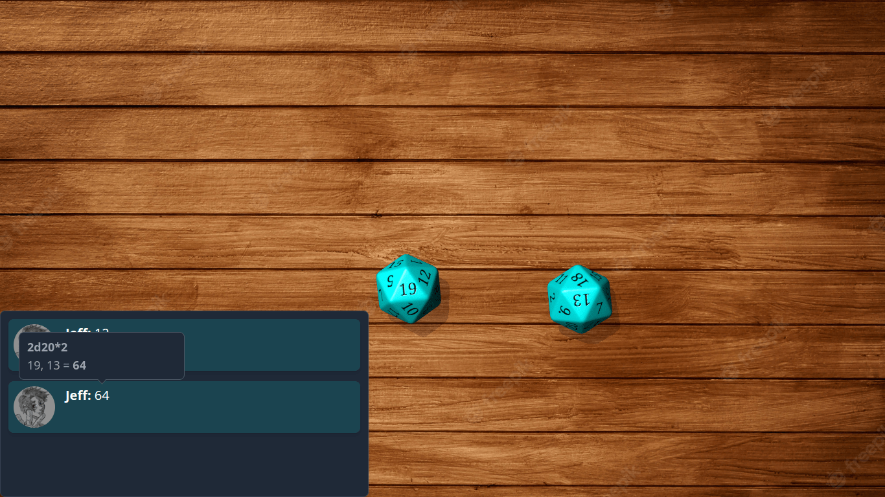

<h1 align="center">
    Character Sheet
</h1>

<h4 align="center"> 
    🚧  Character Sheet 🎲 Finished 🚧 
</h4>


<p align="center">
 <a href="#-about-the-project">About</a> •
 <a href="#screenshots">Screenshots</a> • 
 <a href="#-setup">Setup</a> • 
 <!-- <a href="#-usage">Usage</a> •  -->
 <a href="#-technologies">Technologies</a> • 
 <a href="#-license">License</a>
</p>


## Demo

<p align="center">
  <a href="https://character-sheet.onrender.com/">Demo</a>
</p>

---

## 💻 About the project

The rpg system is from Pathfinder 2e.

The "simple" character sheet app for player and GM.
But it was also made to play during a session, where you can manage your character, watch the dice roll on TV.

Just to let you know that the application was designed to play with everyone together in a room, where you have a tv with internet, if you are thinking of using it to play with other people online, unfortunately it won't work, but you can use it. it as character management, that's all.

## Screenshots

<div style="display: grid">









</div>

## ⚙️ Setup
### Prerequisites to run on local machine
-   **[Git](https://git-scm.com)**
-   **[Ruby on rails](https://rubyonrails.org/)**
-   **[Postgresql](https://www.postgresql.org/)**
-   **[ImageMagick](https://imagemagick.org/index.php) and/or [libvips](https://github.com/libvips/libvips)**
---
First clone the repository.
```bash
git clone https://github.com/XandeKK/Character-Sheet.git
```
Go to Character-Sheet.
```bash
cd Character-Sheet
```
Install the dependencies.
```bash
bundle install
```
Migrate the database.
```bash
rake db:create db:migrate db:seed
```
Test your app to check if everything is ok.
```bash
rake test
```
Run web server.
```bash
rails s
```
Visit http://localhost:3000 in a browser.

If you want to access other devices besides the computer. To get this ip, search "How to find your IP address in my 'OS'".
```bash
rails s -b your-ip
```
Visit http://your-ip:3000 in a browser.

If there is any problem, report it to me.

---

<!-- ## 🎲 Usage -->

## 🛠 Technologies

The following tools were used in building the project:

-   **[Ruby on rails](https://rubyonrails.org/)**
-   **[Postgresql](https://www.postgresql.org/)**
-   **[Dice-box](https://github.com/3d-dice/dice-box)**

## 📝 License

This project is under license [MIT](./LICENSE).

Made with ❤️ by Alexandre Alves 👋🏽 [Contact](https://www.linkedin.com/in/alexandre-dos-santos-alves-707921206/)
